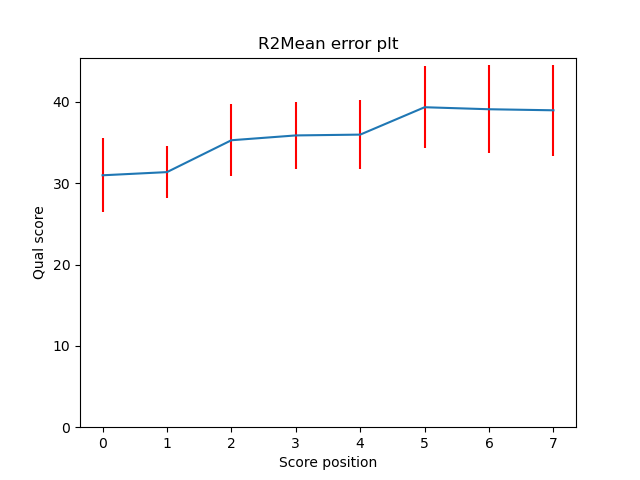
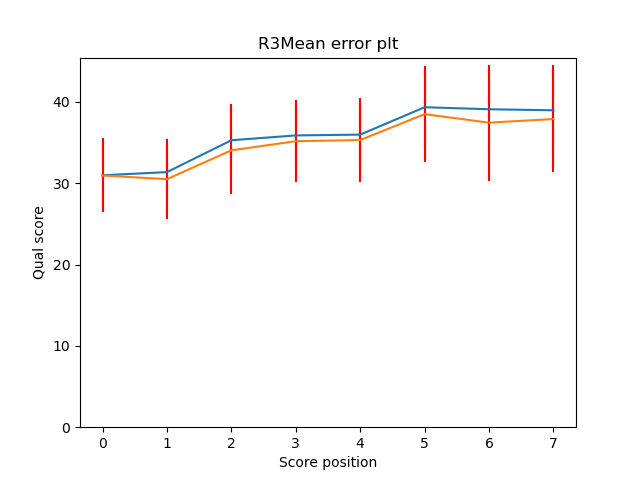

# Assignment the First

## Part 1

1. Be sure to upload your Python script. Provide a link to it here:


| File name                    | label   | Read length | Phred encoding |
| ---------------------------- | ------- | ----------- | -------------- |
| 1294_S1_L008_R1_001.fastq.gz | Read 1  | 101         | 33             |
| 1294_S1_L008_R2_001.fastq.gz | Index 1 | 8           | 33             |
| 1294_S1_L008_R3_001.fastq.gz | Index 2 | 8           | 33             |
| 1294_S1_L008_R4_001.fastq.gz | Read 2  | 101         | 33             |

2. Per-base NT distribution
   1. 
   2. **Looking at the distributions, the quality score average are pretty high for the indexes. What were trying to cut out here is the off chance that an index manipulates into a new index barcode, and the reads go under that name.I think this is very unlikley and it looks like for the minimum case, 3 out of 8 need to change to exactly the right other nucleotide in order to be swapped. With this in mind, it is possibly, but very unlikley, Im going to be setting the threshold very low, because the lowest scores have the highest chance of being randomly assigned a new barcode, or possibly have no threshold at all. Id say 5-10. **
   3. **zcat ../TEST-input_FASTQ/Test_R2.fq.gz | grep -B 1 '+' | grep "N" | wc -l**

      ```f
      I used this command twice on the two index files to find the total amount containnig 'N'.
      3328051 + 3976613 = 7304664 total
      ```

## Part 2

1. Define the problem
2. Describe output
3. Upload your [4 input FASTQ files](../TEST-input_FASTQ) and your [>=6 expected output FASTQ files](../TEST-output_FASTQ).
4. Pseudocode
5. High level functions. For each function, be sure to include:
   1. Description/doc string
   2. Function headers (name and parameters)
   3. Test examples for individual functions
   4. Return statement

Strategy for Demultiplexing

* Initial requirements
* Read1 file is Bio1, Read2 is index1, Read3 is Index2, and Read4 is Bio2
* Each line number in all 4 files line up with the other line # in other files. So entry 8 from file 1 (READ 1), is from the same dna strand as entry 8 from file 4 (READ 4)
* We have 24 indexes that will be the barcodes on the reads, each one of these will need 2 output files, 1 for the read1s and 1 for read2s.
* Need to take the reverse compliment of read3 barcode. For it to line up with first read & barcode
* if the barcodes match within a single paired read, put the two reads into the indexes output files.
* If both barcodes exist, but don't match, you put in an unmatched file, again with two output file 1 and 2 for the unmatched reads
* For unmatched pairs, write the two indexes   <idx1>-<idx2> at the end of the header for both reads
* If one of the barcodes doesn't exist, put they two reads in the unknown two output files
* For unmatched pairs
* 48 index outputs + 2 unmatched outputs + 2 unknown outputs
* STATS output total read-paris that matched, were unmatched, and were unknown
* Pseudo code

MAIN

* Getargs
  * all 4 files of reads
  * minimum qual score
  * Read length
  * Barcode file input
* Create dictionary of the swapped pairs possible
* Create the sums of the counts of paired, unpaired, unknown
* With open all 4 files
  * Take 4 lines from each file * store them in lists that are 4 length and named after each read
    * Take the reverse compliment of the index3 (with function below)
    * See if index 2 and index 3 match and if they both exist
    * Take the quality scores of the two indexes
      * If either is below the quality score Write to the unknown files.
      * The header + indexes ‘<index>-<index>’
      * sequences
      * Quality scores
    * If they do and match, open output files with the name of the barcode ‘{barcodeName}_r1.fq’   and   ‘{barcodeName}_r2.fq’
      * Write to R1 and R2
        * The header + indexes ‘<index>-<index>’
        * sequences
        * Quality scores
      * Count matched pairs +1
      * Write read 1 to R1, read 2 to R2
    * If they both exist but don't match, open the unmatched files: ‘unmatched_R1.fq’   and  ‘unmatched_R2.fq’
      * Count to the dictionary of different unmapped pairs
      * Write to R1 and R2
        * The header + indexes ‘<index>-<index>’
        * sequences
        * Quality scores
      * Count unmatched pairs +1
    * If one or both don't exist, open the unknown output files: ‘unknown_R1.fq’    and   ‘unknown_R2.fq’
      * Write to R1 and R2
        * The header + indexes ‘<index>-<index>’
        * sequences
        * Quality scores
      * Count unknown pairs +1
* RETURN COUNTS OF mapped, unmapped, unknown, and sorted list of the unmatched pairs that are together

FUNCTIONS

- Get args functions

  - Bring in the 4 files as 4 inputs
    - Read length,
    - Minimum quality score
    - Barcode file name
- Mean Convert fred quality score

  - Converts a sequence to a fred quality score
- Implement reverse compliment function (takes in dna strand)

  - Returns the reverse compliment

TEST FILES

- Input
  - Finished input CHA-CHING
  - Have 4 records for each of the 4 read files.
    - Sequences are random valid sequences for each of them
      - 1 case where the indexes match correctly
      - 1 case where they are both valid, but don't match
      - 1 case where one is not valid, should be unknown
      - 1 case where the quality score is low for one of them (9 mean), even though the barcodes are good and match
  - Also have indexes input file that is valid for 2 barcodes
- Output
  - Need to make output
